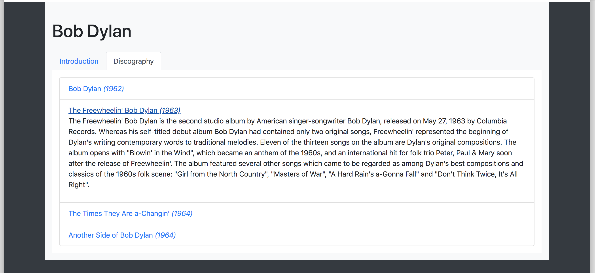

# 0x0A. Bootstrap

    

    Bootstrap is a free, open-source CSS framework for responsive, mobile-oriented front-end web development.
    Contains CSS and JS design templates for:
    - typography
    - forms
    - buttons
    - navigation
    - other interface components

It will use: **Bootstrap 4.4** and only the CSS styling part. → https://getbootstrap.com/docs/4.4/getting-started/introduction/

## Use the CDN version:
`<link rel="stylesheet" href="https://stackpath.bootstrapcdn.com/bootstrap/4.4.1/css/bootstrap.min.css" integrity="sha384-Vkoo8x4CGsO3+Hhxv8T/Q5PaXtkKtu6ug5TOeNV6gBiFeWPGFN9MuhOf23Q9Ifjh" crossorigin="anonymous">`

## Tasks
**[0. Reboot styling](https://github.com/dianaparr/holbertonschool-web_front_end/blob/main/0x0A-Bootstrap/0-index.html)**

The final page must look like this:

 

**[1. Blocks](https://github.com/dianaparr/holbertonschool-web_front_end/blob/main/0x0A-Bootstrap/1-index.html)**

Build this responsive web page:

 

**[2. Table of chemical elements](https://github.com/dianaparr/holbertonschool-web_front_end/blob/main/0x0A-Bootstrap/2-index.html)**

Build this responsive web page:

 

**[3. Cards](https://github.com/dianaparr/holbertonschool-web_front_end/blob/main/0x0A-Bootstrap/3-index.html)**

Build this responsive web page:

 

**[4. Bob Dylan](https://github.com/dianaparr/holbertonschool-web_front_end/blob/main/0x0A-Bootstrap/4-index.html)**

Build this responsive web page:

 

**[5. Show/Hide - screen size](https://github.com/dianaparr/holbertonschool-web_front_end/blob/main/0x0A-Bootstrap/5-index.html)**

Build this responsive web page:

 

**[6. Overwrite CSS](https://github.com/dianaparr/holbertonschool-web_front_end/blob/main/0x0A-Bootstrap/6-styles.css)**

Create the custom stylesheet `6-styles.css` to match this layout.:

